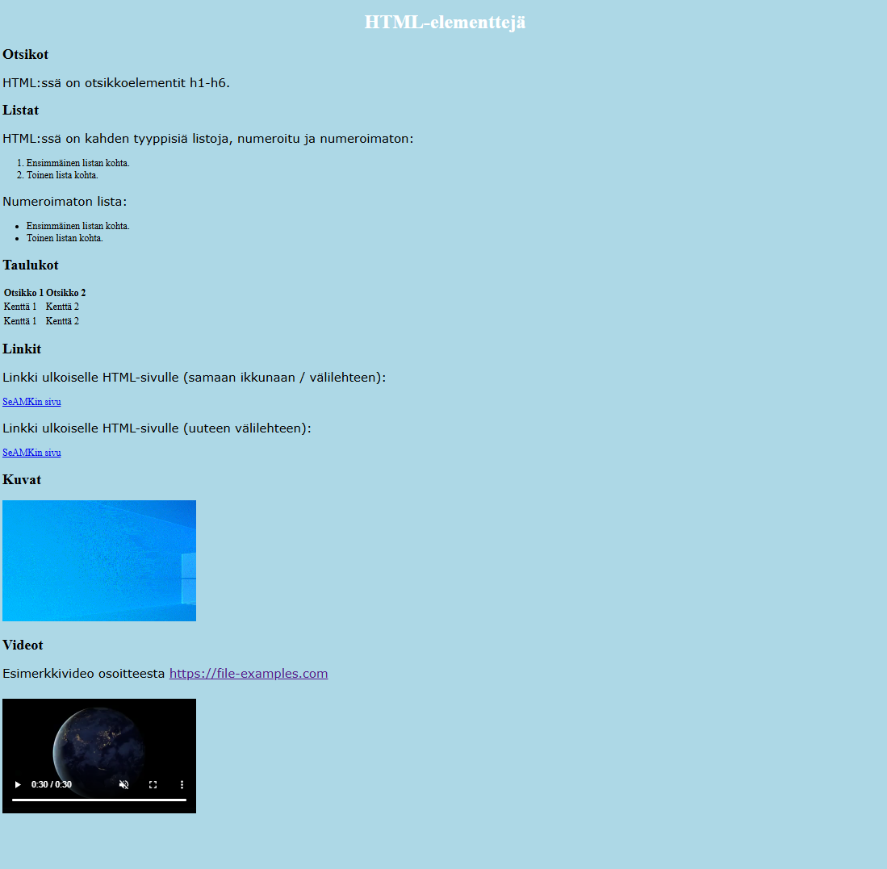

# Web-ohjelmoinnin perusteet
## Tehtävä 5

### Tavoite
Tämän tehtävän tavoitteena on harjoitella CSS-määritysten syntaksia
ja yksinkertaisiä tyylimäärittelyjä.

### CSS-elementtejä
Tee yksinkertainen CSS-tyylitiedosto `tyylit_t5.css` [Tehtävän 3](t3.md)
HTML-tiedostoa `elementteja.html` varten. Sijoita `tyylit_t5.css`-tiedosto
esimerkiksi hakemistoon `tyylit`.

Koska tyylimäärittely on omassa tiedostossaan, siihen on viitattava
`elementteja.html` HTML-sivun sisältävästä tiedosta siten, että selain
käyttää tyylejä näyttäessään HTML-sivun. Tyylejä käyttäjä versio
`elementteja.html`-sivusta voi näyttää esimerkiksi kuvan 1 mukaiselta.
Voit kuitenkin tehdä haluamasi tyylimääritykset.

### Ohjeita
Tyylimäärittelyssä on oltava vähintään jonkin elementin taustan ja tekstin
väriin sekä jonkin tai joidenkin elementtien tekstin fontteihin vaikuttavia
määrityksiä.

Kuvan 1 mukaisessa ratkaisussa on käytetty seuraavia tyylimääreitä:
- `<body>`-elementin taustaväri on vaalensininen (_lightblue_).
- `<h1>`-elementin sisältö on keskitetty (_center_) ja väriltään
valkoinen (_white_).
- `
`-elementin sisällön fonttina käytetään verdanaa (_verdana_) ja fontin
kokona 20 pikseliä (_20px_). 

### Materiaalin, yhteistyön ja tekoälyn käyttö
Hyödynnä tässä tehtävässä
[W3C:n CSS-tutoriaalin](https://www.w3schools.com/css/default.asp) kohtia
[johdanto](https://www.w3schools.com/css/css_intro.asp),
[syntaksi](https://www.w3schools.com/css/css_syntax.asp),
[valitsimet](https://www.w3schools.com/cssref/css_selectors.php),
[taustat](https://www.w3schools.com/css/css_background.asp),
[värit](https://www.w3schools.com/css/css_colors.asp),
[korkeus & leveys](https://www.w3schools.com/css/css_dimension.asp),
[teksti](https://www.w3schools.com/css/css_text.asp),
[fontit](https://www.w3schools.com/css/css_font.asp),
[listat](https://www.w3schools.com/css/css_list.asp),
ja
[taulukot](https://www.w3schools.com/css/css_table.asp).

Voit tarvittaessa pyytää apua toiselta opiskelijalta tai opettajalta. Älä
käytä tässä tehtävässä tekoälyä.

### Kuvat

Kuva 1. Esimerkki sivun `elementteja.html` sisällöstä CSS:n kanssa.
