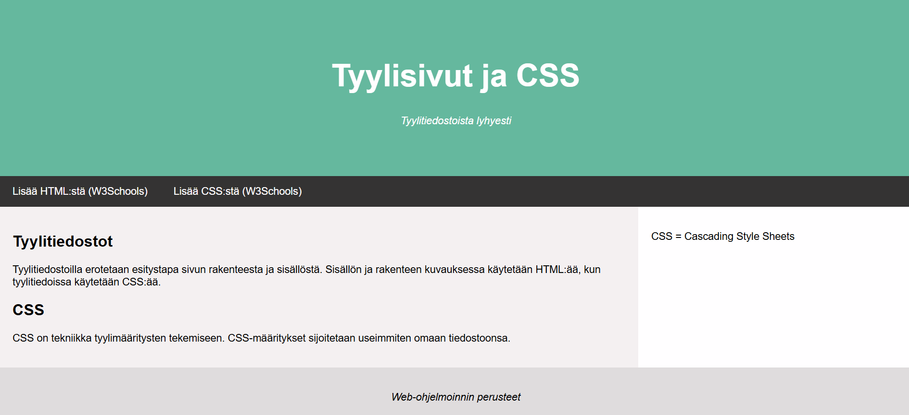

# Web-ohjelmoinnin perusteet
## Tehtävä 6

### Tavoite
Tämän harjoituksen tavoitteena on tutustua tarkemmin tyylimäärittelyjen
tekemiseen CSS:n avulla mukaan lukien sivun asettelu ja navigaatiopalkki.
Lisäksi otetaan huomioon responsiivisuus (sivun asetteluun liittyen).

### HTML-elementtejä
a) Kopioi projektiisi tiedostot
[`tyylisivuista.html`](html/tyylisivuista.html) sekä
[`tyylit_t6.css`](css/tyylit_t6.css) ja
tutustu niihin. Huomioi erityisesti `<div>`-elementtien ja `<class>`
-attribuuttien käyttö sivun osien kuvaamiseen. Ota käyttöön tyylitiedosto
`tyylit_t6.css` poistamalla kommentit tiedostossa `tyylisivuista.html`
`<head>`-osassa olevan `<link>`-elementin ympäriltä ja tutki, miten ulkoasu
muuttuu.

b) Tee tarvittavat muutokset tiedostoon `tyylit_t6.css`, jotta sivun
`tyylisivuista.html` asettelusta tulee kuvan 1 mukainen.

c) Lisää CSS-tyylimäärityksiin alla olevissa ohjeissa mainittu
responsiivisuutta parantava määrittely, joka tekee b-osassa tehdystä
asettelusta näytön kokoon mukautuvan. Kokeile, miten määrittely vaikuttaa,
kun pienennät selainikkunan leveyttä.

### Ohjeita
a) Laita tiedosto `tyylisivuista.html` projektisi alihakemistoon, jossa
pidät _.html_-tiedostoja ja tiedosto `tyylit_t6.css` alihakemistoon, jossa
pidät _.css_-tiedostoja. Muuta tarvittaessa tiedostossa `tyylisivuista.html`
`<head>`-osassa olevan `<link>`-elementin attribuutin `<href>` sisältämää
polkua.

b) Jos käytät _flexbox_-asettelua, voit esimerkiksi määritellä
- _row_-`<div>`:t (elementit, joissa `class="row"`) asettelun juureksi
(_display: flex_ ja _flex-wrap: wrap_), ja
- _main_- ja _side_-`<div>`:t (elementit, joissa `class="main"` ja
`class="side"`) siten, että
    - _main_ vie 70 % käytettävissä olevasta leveydestä (_flex: 70%_), ja
    - _side_ vie loput 30 % _flex: 30%_.

Määrittele lisäksi _main_- ja _side_-`<div>`:eille taustaväri
(_background-color_, _main_:lla _#f1f1f1_ ja _side_:lla _white_) sekä
tyhjä tila (täyte, molemmilla 20 pikseliä eli _padding: 20px_).

Jotta tyhjä tila lasketaan osaksi ao. elementtiä, lisää seuraava
määrittely:
```
* {
  box-sizing: border-box;
}
```
(Jos tätä ei tee, lasketaan _padding_ erikseen esimerkiksi leveyteen,
jolloin yllä olevalla tehdyn asettelun leveys olisi 70 % + 30 % + _padding_:it
pikselinä, ts. yli 100 %.)

c) Lisättävä määrittely on seuraava:
```
@media screen and (max-width: 800px) {
  .row, .navbar {  
    flex-direction: column;
  }
}
```
Voit halutessasi muuttaa `max-width` arvoa.

### Materiaalin, yhteistyön ja tekoälyn käyttö
Hyödynnä tässä tehtävässä [W3C:n HTML-tutoriaalin](https://www.w3schools.com/html/default.asp) aiempine kohtien lisäksi kohtia
[linkit](https://www.w3schools.com/css/css_link.asp),
[navigaatio](https://www.w3schools.com/css/css_navbar.asp),
ja
[flexbox-layout](https://www.w3schools.com/css/css3_flexbox.asp).

Voit tarvittaessa pyytää apua toiselta opiskelijalta tai opettajalta. Älä
käytä tässä tehtävässä tekoälyä.

### Kuvat


Kuva 1. Sivu `tyylisivuista.html` muokatun `tyylit_t6.css`:n kanssa.
